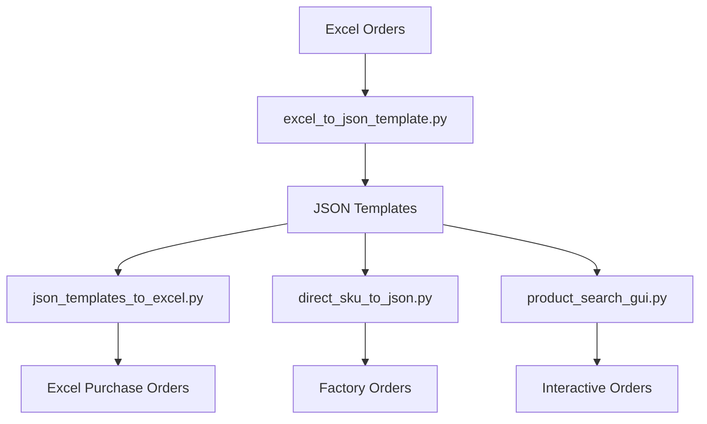

# JSON Templates to Excel Converter

This script converts all JSON template files from the `json_template` directory to Excel files in the format of `empty_base_template.xlsx` and saves them under the `PO_excel` directory.

## Purpose

This is the **inverse operation** of the Excel to JSON template converter. It allows you to:

1. Convert JSON templates back to Excel format for editing or review
2. Generate purchase order Excel files for all products in the template library
3. Create a complete backup of all templates in Excel format
4. Prepare files for suppliers who prefer Excel over JSON

## Features

- **Batch Processing**: Converts all JSON templates in one operation
- **Selective Conversion**: Convert specific templates by name
- **Consistent Format**: Uses `empty_base_template.xlsx` structure via `json_PO_excel.py`
- **Date Handling**: Applies current date and calculated delivery dates
- **Error Handling**: Reports failed conversions with detailed error messages
- **Progress Tracking**: Shows conversion progress and summary

## Usage

### Command Line Options

```bash
# Convert all JSON templates
python json_templates_to_excel.py

# Convert to custom output directory
python json_templates_to_excel.py --output-dir custom_excel_folder

# Convert specific templates
python json_templates_to_excel.py --templates ST1122-1 EEHB-NBB EC1601

# List available templates
python json_templates_to_excel.py --list
```

### Batch File (Windows)

```bash
# Convert all templates
convert_templates_to_excel.bat

# Show help
convert_templates_to_excel.bat --help

# List templates
convert_templates_to_excel.bat --list
```

## Input/Output Structure

### Input Directory
- **Source**: `json_template/` (142 JSON template files)
- **Format**: Standard JSON template structure with cells, products, and footer

### Output Directory  
- **Default**: `PO_excel/` (142 Excel files)
- **Format**: `empty_base_template.xlsx` structure
- **Features**: 
  - Current date in 日期 field
  - Calculated delivery dates based on 交货时间
  - Product images (if available)
  - Complete cell mapping from JSON

## File Mapping

Each JSON template file creates a corresponding Excel file:

```
json_template/ST1122-1.json  ->  PO_excel/ST1122-1.xlsx
json_template/EEHB-NBB.json  ->  PO_excel/EEHB-NBB.xlsx
json_template/EC1601.json    ->  PO_excel/EC1601.xlsx
```

## Excel File Contents

Each generated Excel file contains:

### Metadata Section
- **Supplier Info**: B3 (供货商)
- **Order Details**: G3 (订单号), G4 (日期), G5 (订单安排人)
- **Contact Info**: B4 (电话), B5 (联系人)
- **Logistics**: B12 (进仓地址), B13 (付款方式), B14 (交货时间)
- **Quality**: B15-B17 (箱规, 产前确认样, 出货样)
- **Customization**: F14-G18 (色卡, Logo位置)
- **Notes**: A19-A30 (注意事项 1-12)

### Product Table (Row 7+)
- **Column A**: 产品编号 (Product Code)
- **Column B**: 产品图片 (Product Image) 
- **Column C**: 描述 (Description)
- **Column D**: 数量/个 (Quantity)
- **Column E**: 单价 (Unit Price)
- **Column F**: 金额 (Total = D×E)
- **Column G**: 包装方式 (Packaging)

### Footer Section
- **Row 69**: B69 (买方), E69 (供货商)

## Date Processing

The converter applies intelligent date handling:

1. **日期 (Date)**: Set to current date (2025年09月02日)
2. **交货时间 (Delivery Time)**: 
   - Extracts number from JSON value (e.g., "45" days)
   - Calculates delivery date = today + extracted days
   - Format: YYYY年MM月DD日

## Error Handling

- **Missing Templates**: Skips non-existent files with warning
- **Conversion Errors**: Reports detailed error messages
- **Directory Creation**: Automatically creates output directory
- **File Conflicts**: Overwrites existing Excel files

## Integration

This converter works seamlessly with:

### Input Sources
- ✅ **JSON Templates**: Generated from `excel_to_json_template.py`
- ✅ **Manual Templates**: Hand-created JSON files
- ✅ **System Templates**: Existing template library

### Output Usage
- ✅ **Supplier Orders**: Send Excel files to suppliers
- ✅ **Manual Editing**: Modify in Excel and convert back
- ✅ **Backup/Archive**: Complete Excel backup of template library
- ✅ **Integration**: Compatible with existing Excel workflows

## Performance

- **Speed**: ~142 files converted in ~30 seconds
- **Memory**: Low memory footprint (processes one file at a time)
- **Storage**: Each Excel file ~50-100KB

## Examples

### Convert All Templates
```bash
python json_templates_to_excel.py
# Output: 142 Excel files in PO_excel/
```

### Convert Specific Products
```bash
python json_templates_to_excel.py --templates ST1122-1 EEHB-NBB
# Output: ST1122-1.xlsx, EEHB-NBB.xlsx in PO_excel/
```

### Custom Output Directory
```bash
python json_templates_to_excel.py --output-dir supplier_excel
# Output: 142 Excel files in supplier_excel/
```

### List Available Templates
```bash
python json_templates_to_excel.py --list
# Shows all 142 available JSON templates
```

## Complete Workflow



This converter completes the full bidirectional workflow between Excel and JSON formats, providing maximum flexibility for order management!
